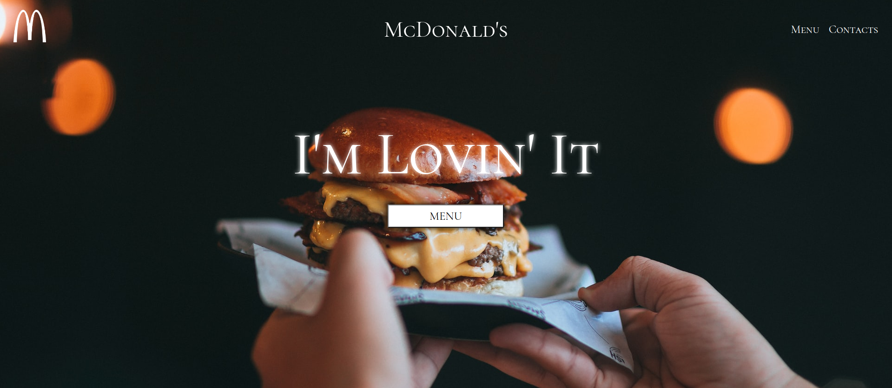
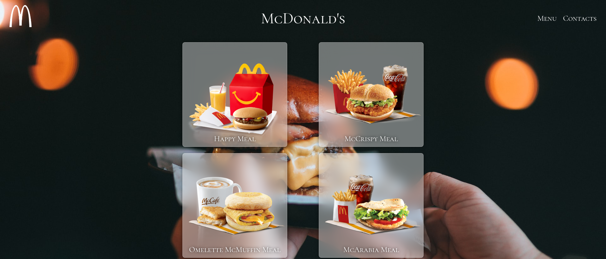
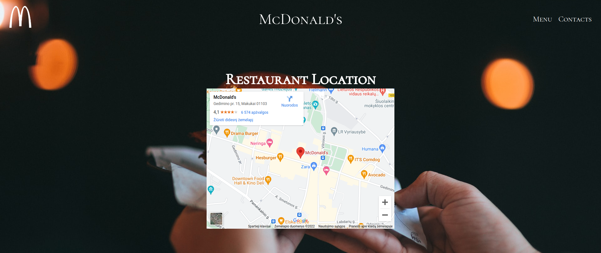

# Restaurant-Page

Odin's project's "Restaurant Page" project made with webpack, different modules, JS logic to switch between tabs.   
(Main - McDonald's logo, Menu - button in the middle or menu tag in header, Contacts - contact tag in header) 
Final page pictures: 

